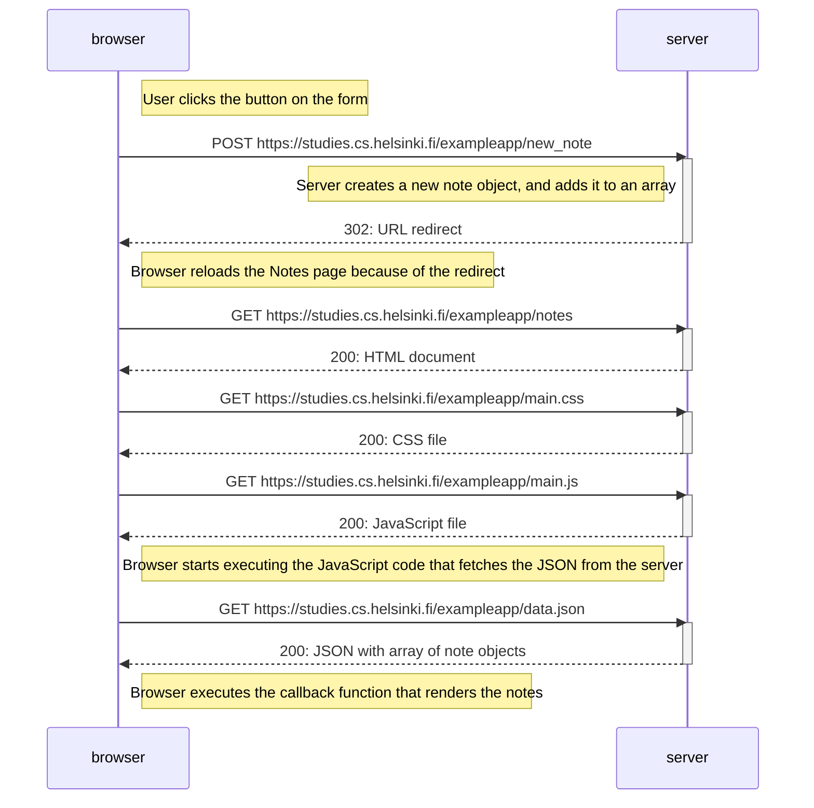
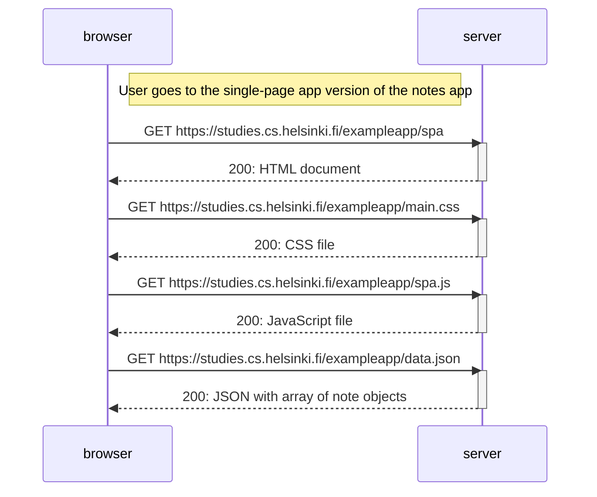
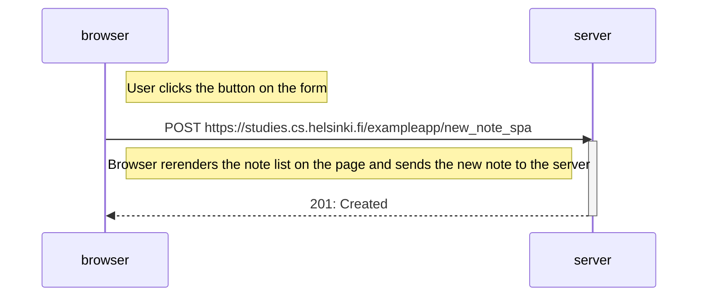

# Part 0 - Fundamentals of Web apps
**Full Stack Open** - Course by the University of Helsinki

*(https://fullstackopen.com/en/part0/fundamentals_of_web_apps)*

## Exercise 0.4: New note diagram

## Exercise 0.5: Single page app diagram

## Exercise 0.6: New note in Single page app diagram

