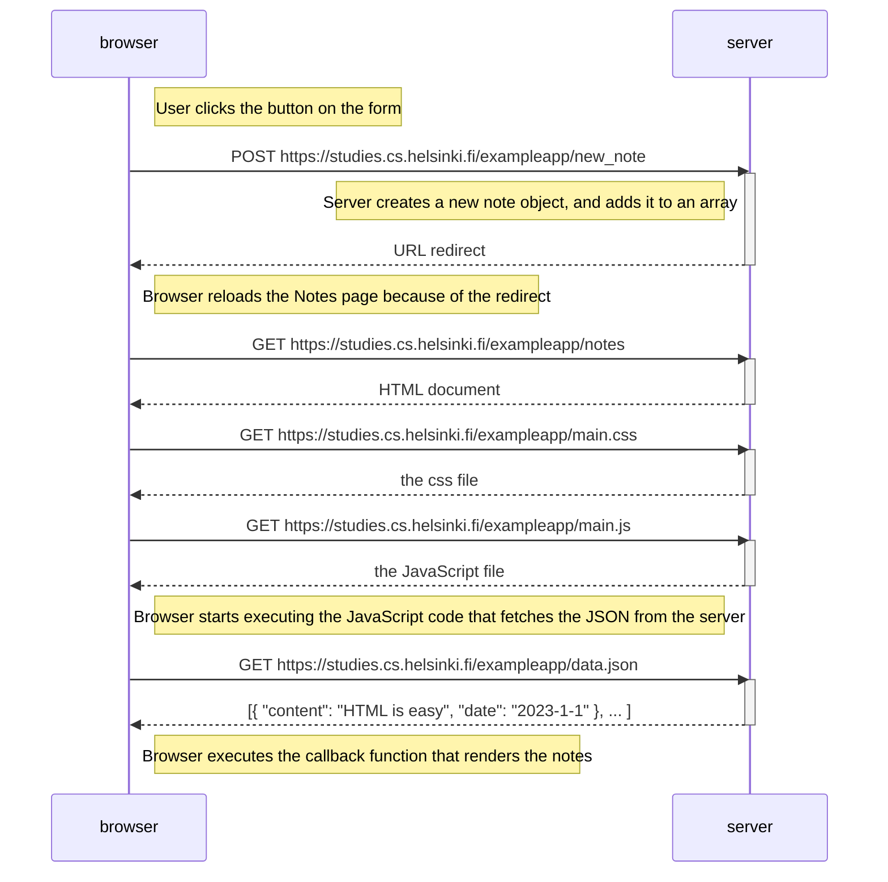

# Part 0 - Fundamentals of Web apps
Full Stack Open - Course by the University of Helsinki

## Exercise 0.4: New note diagram

```mermaid
sequenceDiagram
    participant browser
    participant server

    Note right of browser: User clicks the button on the form

    browser->>server: POST https://studies.cs.helsinki.fi/exampleapp/new_note
    activate server
    Note left of server: Server creates a new note object, and adds it to an array
    server-->>browser: URL redirect
    deactivate server

    Note right of browser: Browser reloads the Notes page because of the redirect

    browser->>server: GET https://studies.cs.helsinki.fi/exampleapp/notes
    activate server
    server-->>browser: HTML document
    deactivate server

    browser->>server: GET https://studies.cs.helsinki.fi/exampleapp/main.css
    activate server
    server-->>browser: the css file
    deactivate server

    browser->>server: GET https://studies.cs.helsinki.fi/exampleapp/main.js
    activate server
    server-->>browser: the JavaScript file
    deactivate server

    Note right of browser: Browser starts executing the JavaScript code that fetches the JSON from the server

    browser->>server: GET https://studies.cs.helsinki.fi/exampleapp/data.json
    activate server
    server-->>browser: [{ "content": "HTML is easy", "date": "2023-1-1" }, ... ]
    deactivate server

    Note right of browser: Browser executes the callback function that renders the notes
```
